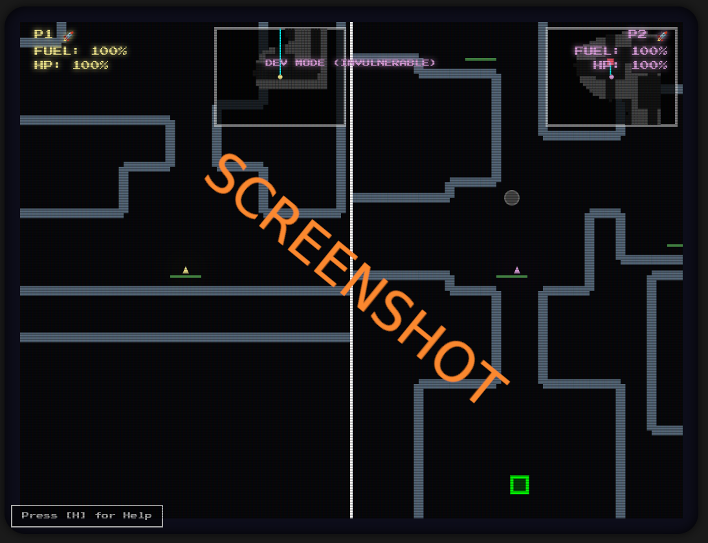

# js_thrustvector

# 🚀 js_thrustvector (Co-op)

## Play it now: https://pemmyz.github.io/js_thrustvector/

A retro-styled **JavaScript browser game** inspired by *Thrust*, with a cooperative twist.  
Two players must clamp onto a physics-driven bomb with short ropes and carefully fly it together through winding caverns to the extraction zone.  

Built with **HTML5 Canvas, CSS3, and vanilla JavaScript** — no external libraries required.  

---

## 🎮 Gameplay

### Objective
Work together to **retrieve the bomb** from deep within the caves and carry it safely to the green extraction zone at the surface.  

### Controls
**Player 1 (P1 🚀)**  
- `A` / `D` → Rotate  
- `W` → Thrust  
- `S` → Clamp / Release  

**Player 2 (P2 🚀)**  
- `←` / `→` → Rotate  
- `↑` → Thrust  
- `↓` → Clamp / Release  

### Mechanics
- **Harmony Meter**: Both ships must clamp onto the bomb to lift it.  
  - Fly smoothly and align angles with your partner.  
  - Poor harmony destabilizes the bomb.  
- **Bomb Stability**: Impacts or disharmony reduce stability. If it reaches **0% → BOOM 💥**.  
- **Hazards**:  
  - Cave walls damage ships.  
  - Hard crashes shake the camera and risk destruction.  
- **Landing Pads** (green): Repair damage and refuel ships.  
- **Fog of War**: Caverns are dark until explored. Each ship gradually uncovers the map.  
- **Minimap + Pathfinding**: A minimap shows explored terrain and objectives. Optional pathfinding hints guide players to the bomb and extraction zone.  

---

## 🕹️ Features

- Co-op **two-player shared-screen or split-screen mode** (toggle in menu)  
- **Procedural random caverns & mazes** with multiple scaling modes  
- Physics-based bomb ropes and stability mechanics  
- Procedurally shaky **harmony/stability HUD**  
- **Dev Mode** (cycle with `[V]`):  
  - Mode 0 → OFF  
  - Mode 1 → Infinite fuel + 75% reduced damage  
  - Mode 2 → Invulnerable  
- Pause anytime with `[P]`  
- In-game help menu with `[H]`  
- Dynamic **minimap with fog-of-war** and pathfinding assistance  

---

## 💡 Future Ideas

- 🎵 Retro sound effects & background music  
- 🌋 More cave hazards (falling rocks, lava, or turrets)  
- 🌍 Online co-op support  
- 📱 Mobile touch controls  
- 🐸 Secret **"AMIGAAA!"** Frog mode  

---

## 📜 License

MIT License  
Free to use, modify, and share.  
